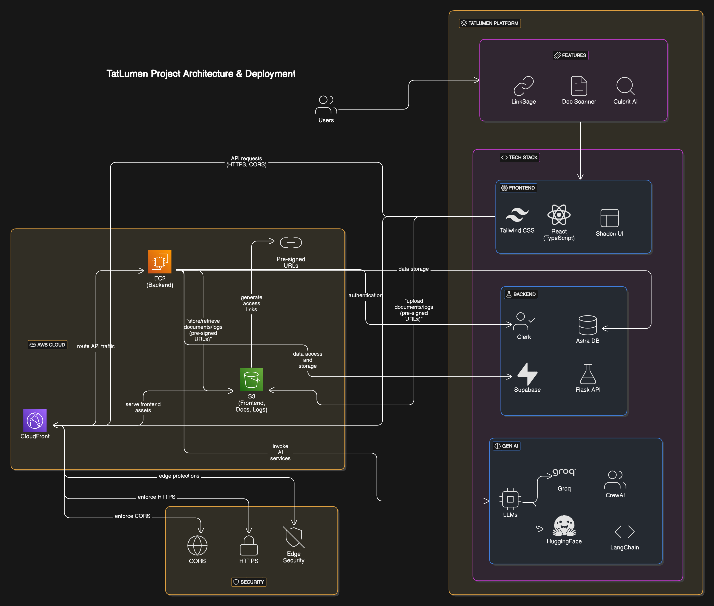

# TatLumen 🚀

TatLumen is an AI-powered multi-featured web platform designed for intelligent content understanding and generation. It brings together link-based Q&A, document summarization, and autonomous research agents — all under a unified interface.

---

## 🔍 Features

### 1. **LinkSage**
- Paste a URL and ask questions. LinkSage reads and understands the webpage content and returns accurate, context-aware answers.
- LinkSage uses LangChain, Groq LLMs, and Hugging Face embeddings to fetch and understand webpage content, transforming it into a searchable vector store.
- Ideal for quickly extracting insights from articles, blogs, and documentation.

### 2. **Doc Scanner**
- Upload a PDF or text document, and click Save to generate a concise, structured summary in Markdown format.
- Doc Scanner is built with PDF parsing tools, LLM summarization, and Markdown rendering, this feature also includes a download option for the generated summary.
- It's useful for students, researchers, and professionals who want quick document overviews.

### 3. **Culprit AI**
- Enter a topic name, and Culprit AI generates an in-depth article in Markdown format, complete with subheadings and clean structure.
- Powered by a multi-agent system (CrewAI), this module mimics a team of AI researchers, writers, and editors working together to produce informative, high-quality content.
- Perfect for crafting compelling blog posts, sharing domain knowledge, or auto-generating educational content with zero manual effort.

---

## 🛠 Tech Stack

- **Frontend:** React (TypeScript), Tailwind CSS, Shadcn UI 
- **Backend:** Flask, Supabase & Clerk (Auth & Data), Astra DB (Data Stacks)
- **Gen AI:** LangChain, LLMs (Groq, Nvidia embed-qa), CrewAI (Multi-Agent System)  

---

## ☁️ Deployment (AWS)  

TatLumen is **fully deployed on AWS**, ensuring high scalability, security, and global availability.

- **Frontend:** Deployed on **S3** and distributed via **AWS CloudFront** for secure and fast global access.
- **Backend:** Hosted on an **EC2 instance** (Ubuntu OS) using Gunicorn and Nginx, with environment isolation and scalable compute resources.
- **Security:** AWS CloudFront manages HTTPS, CORS, and edge security for both frontend and backend.
- **Storage & Access:** Documents and logs are stored securely via S3 and accessed using pre-signed URLs when needed.

---
## 📈 Project Flow

---

## 📝 License

- This project is licensed under the MIT License - see the [LICENSE](LICENSE) file for details.
